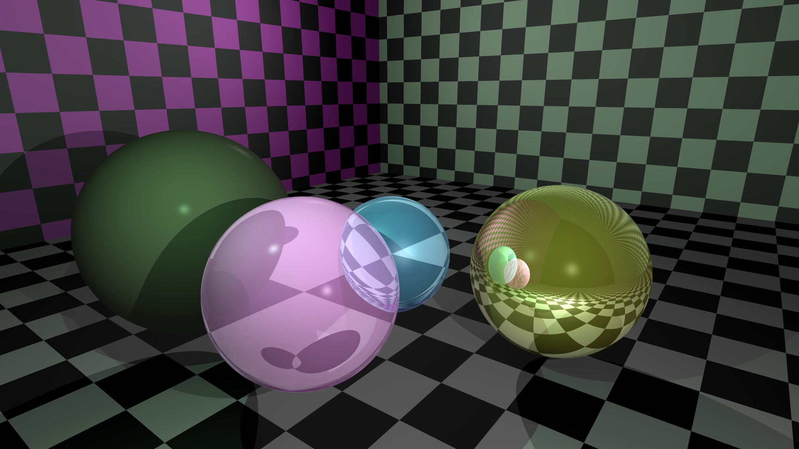
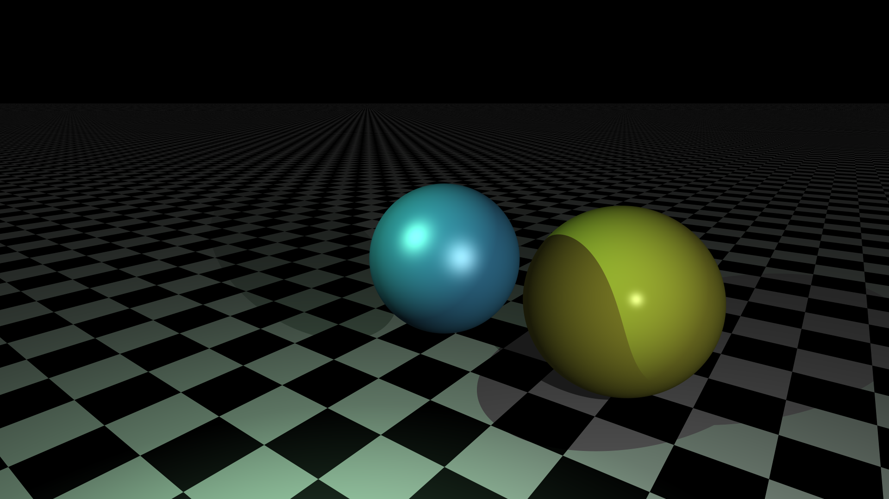

Java Raytracer
==============

This is a software raytracer written in Java. The goal is to learn and understand raytracing techniques (and make very nice looking images).

Current capabilities:
- Spheres/Planes
- Phong shading (how exciting!)
- Reflection/Refraction
- MSAA

Libraries
---------

- [JOML](https://github.com/JOML-CI/JOML) (Vector math)

Renders
-------

